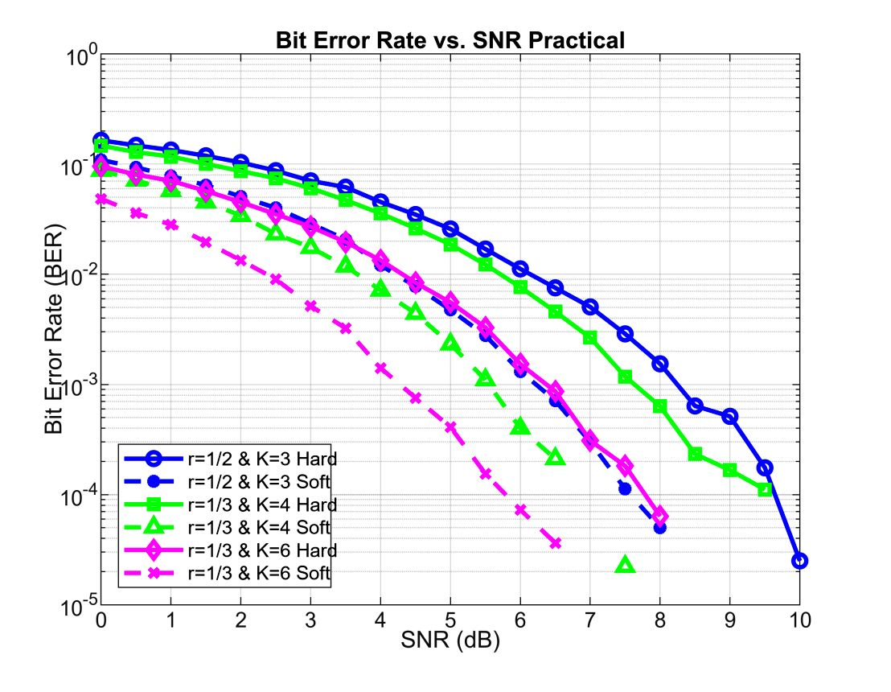

# Convolutional Code Performance Analysis using Viterbi Decoding(Under Prof.Yash Vasavada)

A MATLAB-based simulation environment that analyzes the performance of Convolutional Codes under varying signal conditions. The project models a complete digital communication system over an Additive White Gaussian Noise (AWGN) channel using Binary Phase Shift Keying (BPSK) modulation.

## Project Objective

The core objective of this project is to quantitatively analyze and compare how **code rate ($r$)**, **constraint length ($K$)**, and **quantization levels (Hard vs. Soft Decision)** influence the error-correction capability of a communication system. 

By building a hardware-accurate convolutional encoder and an optimal Viterbi decoder from scratch, this project simulates a real-world communication link. It serves to prove the trade-offs between system complexity, bandwidth expansion, and power efficiency (coding gain) across an SNR range of 0 to 10 dB.

---

## Core Technical Concepts

### 1. Convolutional Encoding
Unlike block codes, convolutional codes introduce memory into the system. An incoming bit stream is passed through a shift register of constraint length $K$. The outputs are generated via modulo-2 addition governed by specific generator polynomials ($g$). The code rate ($r = k/n$) dictates the bandwidth efficiency; for example, a rate $1/3$ code outputs 3 coded bits for every 1 input bit, sacrificing bandwidth to achieve higher redundancy.

### 2. Hard-Decision Viterbi Decoding
In a Hard-Decision system, the receiver performs a threshold check on the continuous, noisy signal coming from the channel immediately, converting it into a discrete binary bit ($0$ or $1$). 
- **Metric Used:** The decoder uses the **Hamming Distance** (counting bit-by-bit differences) along the trellis paths to find the most likely transmitted sequence.
- **Trade-off:** It is computationally simpler and requires less memory, but it discards valuable "confidence" data about the received signal, leading to a poorer Bit Error Rate (BER) at low SNRs.

### 3. Soft-Decision Viterbi Decoding
In a Soft-Decision system, the receiver preserves the unquantized analog voltages (continuous wave values) coming from the channel. It does not force the noisy signal into a $0$ or $1$ prior to decoding.
- **Metric Used:** The decoder evaluates the **Euclidean Distance** (geometric distance) between the received noisy waveform and the ideal BPSK constellation points ($+1$ and $-1$).
- **Trade-off:** By utilizing the exact analog margin or "confidence" of each symbol, soft decision drastically reduces error rates. It typically provides an extra ~2 to 3 dB of coding gain over hard-decision decoding at the cost of higher receiver complexity.

---

## Simulation Results & Performance Curve

The plot below represents the combined Monte Carlo simulation results across 10,000 trials per SNR point. 



### Analyzing the Graph (Interviewer Takeaways):

1. **Soft Decision vs. Hard Decision:** For every single configuration tested, the dashed lines (Soft Decision) sit significantly lower on the BER scale than their solid-line (Hard Decision) counterparts. This visually proves the ~2 dB coding gain advantage provided by Euclidean distance metrics.
2. **The Impact of Constraint Length ($K$):** Comparing the Rate $1/3$ $K=4$ curve against the Rate $1/3$ $K=6$ curve demonstrates that increasing the memory of the encoder yields a steeper waterfall curve, drastically lowering the error floor because the trellis has more states to isolate single-bit errors.
3. **The Coding Trade-off:** Increasing $K$ from 4 to 6 expands the Viterbi trellis states from $2^3 = 8$ states to $2^5 = 32$ states. The graph demonstrates that this four-fold increase in computational complexity pays off directly in system power efficiency (requiring less SNR to achieve a target BER of $10^{-3}$).

---

## File Structure & System Components
- `main_simulation.m`: Coordinated testbench that defines SNR ranges, manages the Monte Carlo loops, calls system scripts, and renders the performance plots.
- `encode_msg.m`: Simulates the shift-register state machine of a convolutional encoder based on input matrix parameters.
- `viterbi_hard.m`: Reconstructs the code trellis and executes forward path accumulation and backtracking using Hamming metrics.
- `viterbi_soft.m`: Reconstructs the code trellis and executes path optimization using continuous squared Euclidean metrics.
- `add_awgn_noise.m`, `map_bits_to_symbols.m`, `threshold_decoder.m`, `generate_random_message.m`: System-level physical layer utilities handling data generation, BPSK mapping, channel impairment, and hard-limiting thresholding.

## How to Run
1. Open MATLAB and point your current directory to this folder.
2. Run the master testbench via the command window:
   ```matlab
   main_simulation
